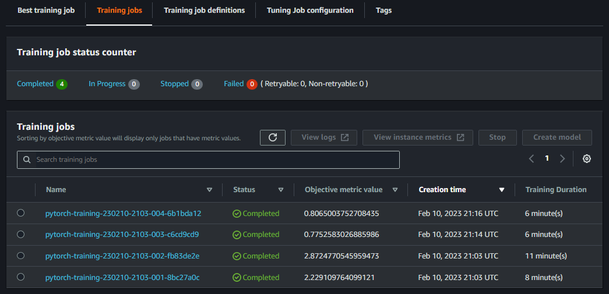
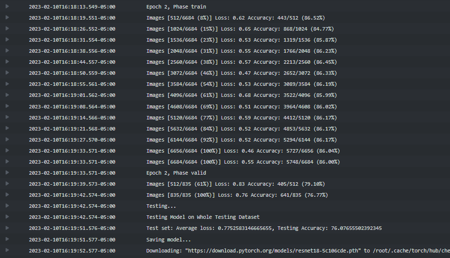
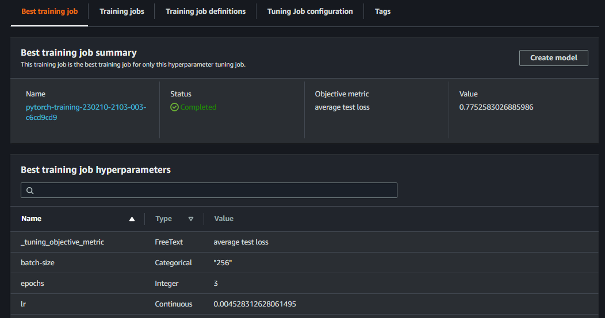
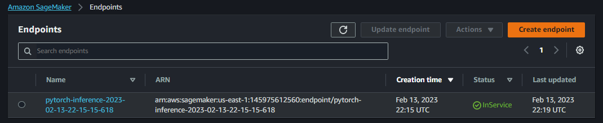

# Dog Breed Image Classification using AWS SageMaker and PyTorch

Use AWS Sagemaker to train a pretrained model that can perform image classification by using the Sagemaker profiling, debugger, hyperparameter tuning and other good ML engineering practices. This can be done on either the provided dog breed classication data set or one of your choice.

## Project Set Up and Installation
Enter AWS through the gateway in the course and open SageMaker Studio. 
Download the starter files.
Download/Make the dataset available. 

## Dataset
The provided dataset is the dogbreed classification dataset which can be found in the classroom.
The project is designed to be dataset independent so if there is a dataset that is more interesting or relevant to your work, you are welcome to use it to complete the project.

### Access
Upload the data to an S3 bucket through the AWS Gateway so that SageMaker has access to the data. 

## Hyperparameter Tuning
PyTorch's TorchVision package provides pre-trained models for different purposes sucha as image classification. ResNet-18 is a convolutional neural network that can classify images into 1000 object categories which is suitable for this project. 

The pre-trained model is tuned with the following hyperparameters:

```python
hyperparameter_ranges = {
    "ContinuousParameter(0.001, 0.1)",
    "batch-size": CategoricalParameter([32, 64, 128, 256, 512]),
    "epochs": IntegerParameter(2, 4)"
}
```

Completed training jobs:  


Logs metrics during the training process:  



Best hyperparameters from all your training jobs:  


## Debugging and Profiling
**TODO**: Give an overview of how you performed model debugging and profiling in Sagemaker

The following rules are set for profiling:
```python
rules = [
    Rule.sagemaker(rule_configs.loss_not_decreasing()),
    ProfilerRule.sagemaker(rule_configs.LowGPUUtilization()),
    ProfilerRule.sagemaker(rule_configs.ProfilerReport()),
    Rule.sagemaker(rule_configs.vanishing_gradient()),
    Rule.sagemaker(rule_configs.overfit()),
    Rule.sagemaker(rule_configs.overtraining()),
    Rule.sagemaker(rule_configs.poor_weight_initialization()),
]
```

### Results
The profiling results are attached into [profiler-report.html](/ProfilerReport/profiler-output/profiler-report.html).

## Model Deployment
An endpoint is deployed in Sagemaker in order to test the model with sample images:



### References
- PyTorch Estimator. Sagemaker. https://sagemaker.readthedocs.io/en/stable/frameworks/pytorch/sagemaker.pytorch.html

- Building, training, and deploying fastai models with Amazon SageMaker. AWS. https://aws.amazon.com/blogs/machine-learning/building-training-and-deploying-fastai-models-with-amazon-sagemaker/ https://github.com/aws/amazon-sagemaker-examples/blob/main/advanced_functionality/fastai_oxford_pets/fastai_lesson1_sagemaker_example.ipynb

- Using Amazon SageMaker Debugger for PyTorch Training Jobs. Sagemaker. https://sagemaker-examples.readthedocs.io/en/latest/sagemaker-debugger/pytorch_model_debugging/pytorch_script_change_smdebug.html

- Deploy a Trained PyTorch Model. Sagemaker. https://sagemaker-examples.readthedocs.io/en/latest/frameworks/pytorch/get_started_mnist_deploy.html
